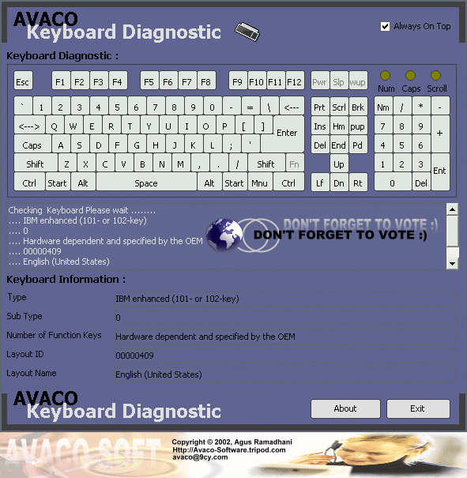



## Avaco Keyboard Diagnostic 2002

### Description

This is program for check or find error on keyboard and another you can look keyboard information. very easy :) this program like Norton Diagnostic for keyboard. thanks.
 
### More Info
 

             |
---                |---
**Submitted On**   |2002-09-15 06:21:14
**By**             |[oom avaco](https://github.com/Planet-Source-Code/PSCIndex/blob/master/ByAuthor/oom-avaco.md)
**Level**          |Advanced
**User Rating**    |4.5 (67 globes from 15 users)
**Compatibility**  |VB 5\.0, VB 6\.0
**Category**       |[Windows System Services](https://github.com/Planet-Source-Code/PSCIndex/blob/master/ByCategory/windows-system-services__1-35.md)
**World**          |[Visual Basic](https://github.com/Planet-Source-Code/PSCIndex/blob/master/ByWorld/visual-basic.md)
**Archive File**   |[Avaco\_Keyb1314239152002\.zip](https://github.com/Planet-Source-Code/oom-avaco-avaco-keyboard-diagnostic-2002__1-39014/archive/master.zip)

